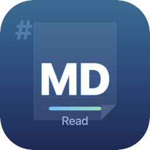

<p align="center">
  
</p>

<h1 align="center">MDRead</h1>

<p align="center">
  A simple, beautiful Markdown reader for macOS.
  <br>
  GitHub-style rendering. No editing. Just reading.
</p>

<p align="center">
  
  
  
</p>

---

## Features

- **GitHub-style Markdown rendering** — Looks just like a GitHub README
- **Syntax highlighting** — Code blocks with language-aware coloring via [highlight.js](https://highlightjs.org/)
- **Light / Dark / Auto mode** — Toggle in the toolbar or follow system appearance
- **Table of Contents sidebar** — Auto-generated from document headings, click to navigate
- **Search** — Find text within documents (Cmd+F)
- **Font size control** — Zoom in/out with Cmd+Plus / Cmd+Minus
- **Print & PDF export** — Print (Cmd+P) or export as PDF (Cmd+Shift+E)
- **YAML frontmatter stripping** — Metadata blocks are hidden, just like on GitHub
- **Window position memory** — Remembers where you left off
- **Drag & drop** — Drop `.md` files onto the app or Dock icon

## Installation

### Download

Download the latest release from the [Releases](https://github.com/AltamimiYasser/MDRead/releases) page.

### Build from Source

```bash
git clone https://github.com/AltamimiYasser/MDRead.git
cd MDRead/MDRead
xcodebuild -scheme MDRead -configuration Release build
```

Or open `MDRead/MDRead.xcodeproj` in Xcode and hit Cmd+R.

## Usage

1. **Open a file** — File > Open (Cmd+O) or double-click any `.md` file
2. **Navigate** — Use the Table of Contents sidebar to jump between sections
3. **Search** — Cmd+F to find text within the document
4. **Zoom** — Cmd+Plus to zoom in, Cmd+Minus to zoom out, Cmd+0 to reset
5. **Theme** — Use the toolbar toggle to switch between Light, Dark, and Auto modes
6. **Export** — Cmd+P to print, Cmd+Shift+E to export as PDF

## Keyboard Shortcuts

| Action | Shortcut |
|--------|----------|
| Open file | Cmd+O |
| Find | Cmd+F |
| Zoom in | Cmd++ |
| Zoom out | Cmd+- |
| Reset zoom | Cmd+0 |
| Print | Cmd+P |
| Export PDF | Cmd+Shift+E |

## Tech Stack

- **SwiftUI** — Native macOS UI framework
- **WebKit (WKWebView)** — Markdown rendering engine
- **[marked.js](https://marked.js.org/)** v15.0.7 — Markdown to HTML parser
- **[highlight.js](https://highlightjs.org/)** v11.11.1 — Syntax highlighting

## Requirements

- macOS 15.0 or later
- Xcode 16+ (for building from source)

## License

MIT License. See [LICENSE](LICENSE) for details.

---

<p align="center">
  Built with SwiftUI and a lot of Markdown.
</p>
